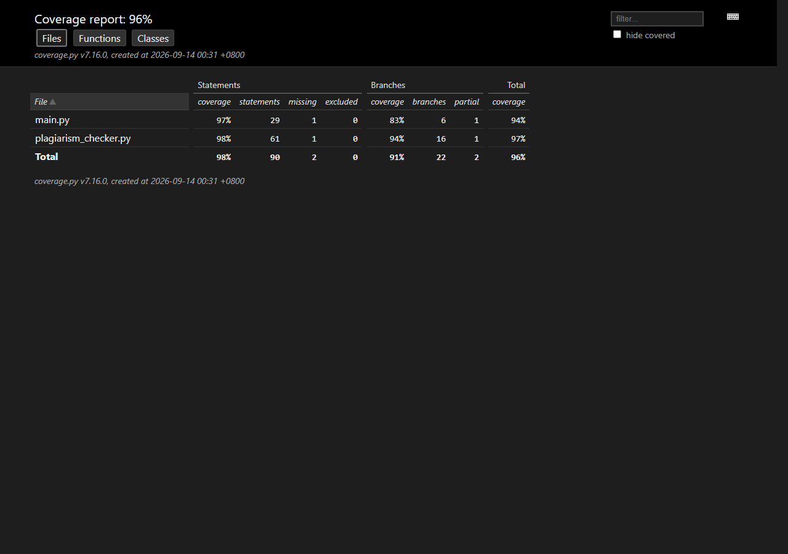

https://github.com/LS-XH/3124004171

# 个人项目：论文查重

## PSP 估算与实际记录

编码前先完成了估算，编码、测试和报告结束后补记实际耗时。完整 PSP 2.1 表见 [PSP.md](PSP.md)：预计 540 分钟，实际 400 分钟。偏差主要来自采用无词典的线性子词算法，减少了依赖调试时间；测试阶段则覆盖了编码和文件异常，耗时接近预计值。

## 计算模块接口的设计与实现

程序分为三层：`main.main` 校验命令行参数并统一处理异常；`main.run` 负责文件输入输出；`plagiarism_checker.calculate_similarity` 是不接触文件的纯计算接口，便于单元测试。其余函数各自负责编码兼容、文本规范化、特征生成和数学计算。


算法使用相邻字符二元组作为局部特征。余弦相似度衡量特征频率分布，适合处理段落增加和删除；Dice 系数直接衡量两个多重集合的重合程度，对局部替换敏感。最终结果为 `0.65 × cosine + 0.35 × dice`。NFKC 规范化使全角/半角、英文大小写差异不被误判，去掉空白和标点后，排版变化也不影响正文比较。

独到之处有三点：算法无需联网和外部词典，评测机可直接运行；输入规模为 n、m 时，平均时间复杂度为 O(n+m)，空间复杂度为 O(n+m)；两项指标复用同一份特征计数，避免重复切分和重复内存占用。

## 性能分析与改进

使用 Python 自带的 `cProfile`（Python 项目对应的 Profiling Tool）对约 66 万字符的两篇构造文本做分析，基准脚本是 `profile/profile_benchmark.py`。首版热点是 `Counter` 构造及 `_ngrams` 生成器：余弦和 Dice 各自生成特征，一共建立四份 Counter，核心函数累计耗时 0.3110 秒。

改进后，两种指标复用原文和疑似文本各一份二元组 Counter，生成器调用次数由约 105.6 万降至 52.8 万。核心函数累计耗时降至 0.1692 秒，下降 45.6%，相似度结果仍为 0.6823。性能改进与复测约用 35 分钟。


机器可读的原始汇总见 `profile/profile_report.txt`，图表由 `profile/generate_profile_report.py` 从 `.prof` 数据自动生成，不是手工填写。

## 单元测试与覆盖率

采用等价类、边界值和白盒分支覆盖设计了 21 个自动化测试，主要包括：完全相同、完全不同、局部增删改、对称性、双方空文本、单方空文本、纯标点、全半角/大小写、单字符、多重特征、UTF-8 BOM、GB18030、未知编码、文件不存在、参数数量错误、相对路径和输出目录不存在。

代表性的计算模块测试如下：

```python
def test_small_edit_retains_similarity() -> None:
    original = "今天是星期天，天气晴，今天晚上我要去看电影。"
    suspect = "今天是周天，天气晴朗，我晚上要去看电影。"
    assert 0.5 < calculate_similarity(original, suspect) < 1.0
```

测试命令 `python -m pytest` 同时启用 `pytest-cov` 的语句和分支覆盖。21 项测试全部通过，综合覆盖率 96.43%（报告页面取整显示 96%）。



## 异常处理说明

异常处理的目标是让程序在 5 秒限制内明确失败、返回非零退出码，并且不留下伪造答案。

- 参数数量错误或使用相对路径：返回退出码 2，并在标准错误输出打印规范用法。对应测试 `test_main_rejects_wrong_argument_count` 和 `test_main_rejects_relative_paths`。
- 输入文件不存在、无权限或把目录当文件：捕获 `OSError`，返回退出码 1。对应测试 `test_main_handles_missing_input_file`，并确认答案文件没有被创建。
- UTF-8 解码失败：自动尝试 GB18030；两者都失败时给出“无法识别文件编码”。对应测试 `test_read_text_rejects_unknown_encoding`。
- 输出目录不存在或不可写：捕获写文件产生的 `OSError` 并返回 1。对应测试 `test_main_handles_unwritable_output_location`。
- 空文本或仅含标点：双方都无正文时定义为 1.00，只有一方无正文时定义为 0.00。参数化测试 `test_empty_content_boundaries` 覆盖了三个分支。

## 代码质量与总结

`pyproject.toml` 启用了 Ruff 的错误、导入、Bugbear、现代化和简化规则。执行 `python -m ruff check .` 与 `python -m ruff format --check .` 均无警告；测试配置要求覆盖率低于 95% 时自动失败。

这次实践中，先把文件 I/O 与纯计算接口分离，明显降低了测试构造成本。性能分析也说明直觉优化并不够：真正热点不是公式本身，而是重复生成特征。后续若有带人工标签的数据集，可以用网格搜索校准 0.65/0.35 权重，并增加语义同义词能力；但当前实现优先保证离线、确定性、资源可控和评测环境可运行。
