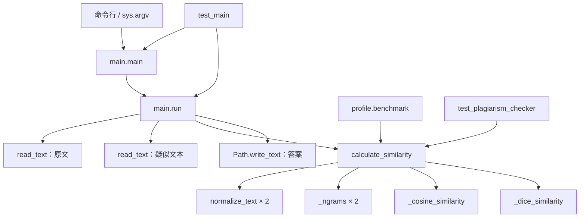
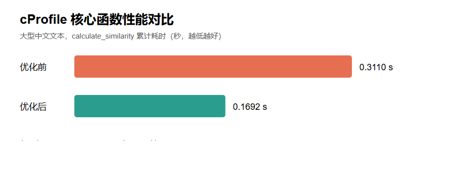

https://github.com/LS-XH/3124004171

# 个人项目：论文查重（3124004171）

本项目是软件工程课程的第一次作业。程序接收原文、疑似抄袭论文和答案文件的绝对路径，计算两篇论文的重复率，并将结果以保留两位小数的浮点数写入答案文件。


## 项目结构

```text
作业一/
├── README.md                         # 项目总说明、设计、测试、性能分析和 PSP 记录
├── main.py                           # 命令行入口、参数校验、文件输入输出和异常处理
├── plagiarism_checker.py            # 文本规范化、特征提取及相似度计算核心模块
├── requirements.txt                 # 测试、覆盖率和代码质量工具依赖
├── pyproject.toml                    # pytest、coverage 和 Ruff 的统一配置
├── 测试文本.zip                      # 课程测试文本压缩包
├── docs/
│   ├── coverage_screenshot.png       # 单元测试覆盖率截图
│   └── performance_screenshot.png    # cProfile 优化前后性能对比截图
├── profile/
│   ├── profile_benchmark.py          # 构造大文本并运行核心算法的性能基准代码
│   ├── generate_profile_report.py    # 从 cProfile 数据生成报告和 SVG 图的代码
│   ├── performance_comparison.svg    # 自动生成的性能对比矢量图
│   └── profile_report.txt            # 优化前后的性能数据摘要
└── tests/
    ├── test_main.py                  # 命令行、文件读写和异常处理单元测试
    ├── test_plagiarism_checker.py    # 相似度计算模块白盒单元测试
    ├── orig.txt                      # 课程测试原文
    ├── orig_0.8_add.txt              # 增加内容后的对比文本
    ├── orig_0.8_del.txt              # 标记为删除内容的对比文件
    ├── orig_0.8_dis_1.txt            # 标记为第 1 种打乱内容的对比文件
    ├── orig_0.8_dis_10.txt           # 标记为第 10 种打乱内容的对比文件
    └── orig_0.8_dis_15.txt           # 标记为第 15 种打乱内容的对比文件
```

运行测试后生成的 `.coverage`、`htmlcov/`、`__pycache__/`、`.pytest_cache/` 和 `.ruff_cache/` 都是临时产物，已经通过 `.gitignore` 排除，不属于需要提交的源代码。

## 环境与运行方法

- Python 3.10 或更高版本
- 安装测试和质量检查工具：`python -m pip install -r requirements.txt`

程序严格按三个命令行参数运行：

```powershell
python main.py C:\tests\orig.txt C:\tests\orig_add.txt C:\tests\ans.txt
```

三个参数依次为原文文件、疑似抄袭论文文件和答案文件的绝对路径。例如，两篇文本完全相同时，答案文件中写入 `1.00`。程序支持 UTF-8（含 BOM）和 GB18030 编码。

## PSP 开发前估算

下表是在开始编写程序之前填写的估算，只记录计划值；项目完成后的实际耗时统一放在 README 文末附录中。单位为分钟。

| PSP | Personal Software Process Stages | 估计耗时（min） |
|---|---|---:|
| Planning | 计划 | 30 |
| · Estimate | · 估计这个任务需要多少时间 | 30 |
| Development | 开发 | 390 |
| · Analysis | · 需求分析（包括学习新技术） | 40 |
| · Design Spec | · 生成设计文档 | 30 |
| · Design Review | · 设计复审 | 20 |
| · Coding Standard | · 代码规范 | 10 |
| · Design | · 具体设计 | 40 |
| · Coding | · 具体编码 | 120 |
| · Code Review | · 代码复审 | 30 |
| · Test | · 测试、自测、修改代码 | 100 |
| Reporting | 报告 | 120 |
| · Test Report | · 测试报告 | 40 |
| · Size Measurement | · 计算工作量 | 20 |
| · Postmortem & Process Improvement Plan | · 事后总结并提出过程改进计划 | 60 |
| **合计** |  | **540** |

## 计算模块接口的设计与实现

项目没有需要保存状态的对象，因此没有为了形式而设计类，而是采用职责单一的函数式接口。命令行、文件读写和计算逻辑彼此分离，其中 `calculate_similarity` 是核心计算模块对外提供的接口，不直接访问文件，因而可以独立测试。

### 核心模块和函数

| 所属文件 | 模块或函数 | 输入 | 输出 | 主要功能 | 直接调用或依赖 |
|---|---|---|---|---|---|
| `main.py` | 命令行入口模块 | 命令行中的三个绝对路径 | 进程退出码 | 连接用户输入、文件接口和计算模块，是程序的执行入口 | `main()` |
| `main.py` | `main(argv=None)` | 参数字符串序列；省略时读取 `sys.argv` | `int`：0 成功、1 运行错误、2 参数错误 | 检查参数数量及绝对路径，调用业务入口，统一捕获可预期异常并向标准错误输出提示 | `run()` |
| `main.py` | `run(original_path, suspect_path, answer_path)` | 三个 `Path` 对象 | `float` 重复率 | 读取两篇论文，调用纯计算接口，并以两位小数写入指定答案文件 | `read_text()`、`calculate_similarity()`、`Path.write_text()` |
| `plagiarism_checker.py` | 相似度计算模块 | 两段文本或文本路径 | 文本、特征集合或相似度 | 集中实现编码兼容、文本预处理、特征生成和相似度公式 | 下列计算函数 |
| `plagiarism_checker.py` | `read_text(path)` | 输入文件的 `Path` | `str` 文本 | 优先按 UTF-8（含 BOM）读取，解码失败后尝试 GB18030；无法解码时抛出明确异常 | `Path.read_text()` |
| `plagiarism_checker.py` | `normalize_text(text)` | 原始字符串 | 规范化字符串 | 执行 NFKC 全半角统一、英文小写化，并移除空白和标点，降低排版差异干扰 | `unicodedata.normalize()`、正则表达式 |
| `plagiarism_checker.py` | `tokenize(text)` | 规范化文本 | `list[str]` | 提取英文单词和中文二元子词，作为可单独使用和测试的辅助分词接口 | `_ngrams()` |
| `plagiarism_checker.py` | `_ngrams(text, size=2)` | 文本和 n-gram 长度 | `Iterable[str]` | 以生成器形式产生连续字符二元组；单字符文本自身作为一个特征，避免额外列表内存 | 无 |
| `plagiarism_checker.py` | `_cosine_similarity(left, right)` | 两个特征频次 `Counter` | `[0, 1]` 内的 `float` | 计算稀疏词频向量的余弦相似度，衡量两篇文本的特征频率分布 | `math.sqrt()`、`Counter.get()` |
| `plagiarism_checker.py` | `_dice_similarity(left, right)` | 两个特征频次 `Counter` | `[0, 1]` 内的 `float` | 计算两个多重集合的 Sørensen-Dice 系数，衡量实际重合特征数量 | `Counter` 交集运算 |
| `plagiarism_checker.py` | `calculate_similarity(original, suspect)` | 原文和疑似抄袭文本 | `[0, 1]` 内的 `float` | 规范化两篇文本，只生成一次特征计数，融合 `0.65 × cosine + 0.35 × dice`，并处理空文本边界 | `normalize_text()`、`_ngrams()`、`_cosine_similarity()`、`_dice_similarity()` |

以下划线开头的函数属于模块内部实现细节；`read_text`、`normalize_text`、`tokenize` 和 `calculate_similarity` 可以作为公开接口导入。实际命令行计算的主路径不会调用 `tokenize`，而是让两项相似度直接复用同一对 `_ngrams` Counter，以减少约一半的特征生成开销。

### 性能分析和测试辅助模块

| 所属文件 | 模块或函数 | 功能 |
|---|---|---|
| `profile/profile_benchmark.py` | `build_documents(repetitions=12000)` | 构造包含局部增删改的大型中文原文和疑似文本，为性能测试提供可重复输入 |
| `profile/profile_benchmark.py` | `benchmark()` | 调用 `calculate_similarity()` 完成一次大文本基准计算并返回结果 |
| `profile/generate_profile_report.py` | `cumulative_time(stats, function_name)` | 从 `pstats.Stats` 中提取指定函数的累计耗时 |
| `profile/generate_profile_report.py` | `main()` | 读取优化前后的 `.prof` 数据，计算耗时下降比例，并生成 TXT 与 SVG 性能报告 |
| `tests/test_main.py` | 文件接口测试模块 | 测试两位小数输出、正确参数、参数不足、相对路径、文件不存在和输出失败等分支 |
| `tests/test_plagiarism_checker.py` | 核心算法测试模块 | 测试文本规范化、特征生成、数学公式、字符编码、空文本和相似度边界 |

### 调用关系

下面的图只表示函数之间的静态调用关系，不表示程序处理步骤：



### 算法关键与独到之处

关键函数是 `calculate_similarity()`。其处理步骤较短，接口表和调用关系图已经可以准确表达设计，因此不再重复绘制业务流程图。算法使用相邻字符二元组作为局部特征；余弦相似度衡量特征频率分布，适合处理段落增加和删除；Dice 系数衡量两个多重集合的重合程度，对局部替换较敏感。最终结果为 `0.65 × cosine + 0.35 × dice`。

NFKC 规范化使全角、半角和英文大小写差异不被误判，去掉空白与标点后，排版变化也不会影响正文比较。输入规模分别为 n 和 m 时，算法平均时间复杂度为 O(n+m)，空间复杂度为 O(n+m)。算法不需要联网或外部词典，并且两项指标复用同一份特征计数。

## 单元测试与覆盖率

采用等价类、边界值和白盒分支覆盖设计了 21 个自动化测试，包括完全相同、完全不同、局部增删改、对称性、双方空文本、单方空文本、纯标点、全半角与大小写、单字符、多重特征、UTF-8 BOM、GB18030、未知编码、文件不存在、参数数量错误、相对路径和输出目录不存在等情况。

测试对象和数据构造思路如下：

| 被测试函数或模块 | 测试数据构造方法 | 主要验证内容 |
|---|---|---|
| `calculate_similarity()` | 构造完全相同、完全不同、局部替换和前后顺序互换的文本 | 结果边界、局部修改敏感性和算法对称性 |
| `normalize_text()` | 混合全角/半角、大小写、空格和中英文标点 | 与内容无关的格式差异被正确消除 |
| `_ngrams()`、`tokenize()` | 使用空串、单字符、三字符及中英文混合内容 | 循环边界、短文本分支和特征顺序 |
| `_cosine_similarity()`、`_dice_similarity()` | 手工构造空 Counter、单边为空、完全重合及重复特征 | 数学公式及零向量分支正确 |
| `read_text()` | 临时生成 UTF-8 BOM、GB18030、非法字节和不存在的文件 | 编码回退与异常分支正确 |
| `main()`、`run()` | 使用临时绝对路径、错误参数数量、相对路径和无效输出目录 | 文件接口、退出码、两位小数格式和错误提示 |

代表性的计算模块测试如下：

```python
def test_small_edit_retains_similarity() -> None:
    original = "今天是星期天，天气晴，今天晚上我要去看电影。"
    suspect = "今天是周天，天气晴朗，我晚上要去看电影。"
    assert 0.5 < calculate_similarity(original, suspect) < 1.0
```

该用例直接测试纯计算接口，通过只替换“星期天/周天”、增加“晴朗”中的字符和删除一个“今天”，验证少量增删改后重复率应下降但仍明显大于完全不同文本。数学边界另用可人工计算期望值的 Counter 验证：

```python
def test_dice_handles_multisets_and_empty_vectors() -> None:
    assert _dice_similarity(Counter(), Counter()) == 1.0
    assert _dice_similarity(Counter({"ab": 2}), Counter()) == 0.0
    assert _dice_similarity(Counter({"ab": 2}), Counter({"ab": 1})) == pytest.approx(
        2 / 3
    )
```

执行以下命令进行测试和质量检查：

```powershell
python -m pytest
python -m ruff check .
python -m ruff format --check .
```

测试结果为 **21 passed**，语句与分支综合覆盖率为 **96.43%**，超过配置中要求的 95%；Ruff 静态分析和格式检查均为零警告。


## 课程 TXT 样例实测

使用 `tests/orig.txt` 作为原文，将另外五个 TXT 依次作为疑似抄袭文本，通过规定的 `python main.py [原文] [抄袭文] [答案]` 文件接口进行测试。所有命令都正常结束，退出码均为 0。

| 对比文件 | 文件大小 | 输出重复率 | 单次耗时 | 数据检查结论 |
|---|---:|---:|---:|---|
| `orig_0.8_add.txt` | 34,860 B | **0.84** | 约 0.12 s | 可读取，但原文和本文件均含大量 `�` 替换字符，疑似已经转码损坏 |
| `orig_0.8_del.txt` | 162,929 B | **0.05** | 约 0.07 s | 文件实际以 `<!DOCTYPE html>` 开头，是 GitHub 网页源码而非论文正文 |
| `orig_0.8_dis_1.txt` | 168,169 B | **0.07** | 约 0.08 s | 文件实际是 GitHub 网页源码而非论文正文 |
| `orig_0.8_dis_10.txt` | 168,169 B | **0.06** | 约 0.08 s | 文件实际是 GitHub 网页源码而非论文正文 |
| `orig_0.8_dis_15.txt` | 168,136 B | **0.04** | 约 0.08 s | 文件实际是 GitHub 网页源码而非论文正文 |

其中 add 样例的计算结果为 0.84，与文件名标注的 0.8 较接近。其余四项的低重复率不是程序异常：这些 `.txt` 保存的是 GitHub HTML 页面，页面标题仍包含 `qizong007/111800827` 仓库路径。程序比较的是文件实际内容，因此不能用这四个结果评价论文查重准确度。压缩包中的对应文件与 `tests/` 下文件大小一致。应重新下载原始纯文本后再次运行，届时只需替换 TXT 文件，不需要修改程序。

## 异常处理说明

异常处理的目标是在输入不合法时明确失败、返回非零退出码，并且不留下伪造的答案文件。

| 异常类型 | 设计目标 | 对应错误场景 | 单元测试样例 |
|---|---|---|---|
| 参数错误 | 在访问文件前拒绝无效调用，打印标准用法并返回退出码 2 | 参数不足、多余或任一路径不是绝对路径 | `test_main_rejects_wrong_argument_count`、`test_main_rejects_relative_paths` |
| 输入文件 I/O 错误 | 不发生异常退出，不生成误导性的答案文件，返回退出码 1 | 文件不存在、无读取权限或把目录作为输入文件 | `test_main_handles_missing_input_file` |
| 字符编码错误 | UTF-8 失败后兼容 GB18030，两种编码均失败才报告明确错误 | 输入包含两种编码都无法解析的非法字节 | `test_read_text_rejects_unknown_encoding` |
| 输出文件 I/O 错误 | 计算后若答案无法落盘，给出错误信息并返回退出码 1 | 输出目录不存在或文件不可写 | `test_main_handles_unwritable_output_location` |
| 空正文边界 | 对合法但没有正文的输入给出确定结果，不发生除零错误 | 双方为空、单方为空或文本仅含标点 | `test_empty_content_boundaries` |

下面为每类异常或边界情况各选取的实际测试代码。

参数错误：

```python
def test_main_rejects_relative_paths(capsys) -> None:
    assert main(["original.txt", "suspect.txt", "answer.txt"]) == 2
    assert "绝对路径" in capsys.readouterr().err
```

输入文件不存在：

```python
def test_main_handles_missing_input_file(tmp_path: Path, capsys) -> None:
    missing = tmp_path / "missing.txt"
    answer = tmp_path / "answer.txt"
    assert main([str(missing), str(missing), str(answer)]) == 1
    assert "错误" in capsys.readouterr().err
    assert not answer.exists()
```

无法识别字符编码：

```python
def test_read_text_rejects_unknown_encoding(tmp_path) -> None:
    invalid_file = tmp_path / "invalid.txt"
    invalid_file.write_bytes(b"\xff")
    with pytest.raises(ValueError, match="无法识别文件编码"):
        read_text(invalid_file)
```

输出目录不存在：

```python
def test_main_handles_unwritable_output_location(tmp_path: Path, capsys) -> None:
    original = tmp_path / "original.txt"
    suspect = tmp_path / "suspect.txt"
    original.write_text("正文", encoding="utf-8")
    suspect.write_text("正文", encoding="utf-8")
    invalid_answer = tmp_path / "missing-directory" / "answer.txt"
    assert main([str(original), str(suspect), str(invalid_answer)]) == 1
    assert "错误" in capsys.readouterr().err
```

空正文边界使用参数化测试同时覆盖三个分支：

```python
@pytest.mark.parametrize(
    ("left", "right", "expected"),
    [("", "", 1.0), ("", "正文", 0.0), ("!!!", "？？", 1.0)],
)
def test_empty_content_boundaries(left: str, right: str, expected: float) -> None:
    assert calculate_similarity(left, right) == expected
```

## 性能分析与改进

性能分析与改进阶段实际耗时 **35 分钟**。使用 Python 自带的 `cProfile` 对合计约 61.2 万字符的两篇构造文本进行分析，基准代码为 `profile/profile_benchmark.py`。首个版本的热点是 `Counter` 构造及 `_ngrams` 生成器：余弦和 Dice 分别生成特征，共建立四份 Counter。

优化前 cProfile 按累计耗时排序的核心函数如下：

| 函数 | 调用次数 | 函数自身耗时 | 累计耗时 | 分析结论 |
|---|---:|---:|---:|---|
| `calculate_similarity()` | 1 | 0.006 s | **0.311 s** | 整个核心接口累计耗时最大，是性能改进的主要对象 |
| `_ngrams` 生成器表达式 | 1,056,000 | **0.139 s** | 0.139 s | 内部实际计算热点，说明特征被重复生成 |
| `tokenize()` | 2 | 0.000 s | **0.116 s** | 累计时间主要来自其内部生成、扩展和计数操作 |
| `normalize_text()` | 2 | 0.001 s | 0.022 s | 文本规范化耗时较小，不是首要瓶颈 |

改进后，两种指标复用原文和疑似文本各一份二元组 Counter，生成器调用次数由约 105.6 万次降至 52.8 万次。核心函数累计耗时降至 0.1692 秒，下降 **45.6%**，相似度结果仍为 0.6823。性能改进与复测约耗时 35 分钟。

| 性能指标 | 实测结果 |
|---|---:|
| 原文字符数 | 300,000 |
| 疑似文本字符数 | 312,000 |
| 优化前核心函数累计耗时 | 0.3110 s |
| 优化后核心函数累计耗时 | 0.1692 s |
| 耗时下降比例 | 45.6% |
| `tracemalloc` 测得峰值额外内存 | 5.30 MiB |
| 优化前后相似度 | 均为 0.6823 |

时间和内存都远低于评测限制的 5 秒与 2048 MB。字符二元组保留局部顺序，余弦与 Dice 的加权同时兼顾频率分布和实际重合量；完全相同、完全不同、局部增删改等自动化测试均符合预期，有效课程 add 样例输出 0.84。由于其余四份课程样例实际为 HTML 页面，项目不使用这些无效文件虚构准确率结论。



性能分析可以使用以下命令复现：

```powershell
python -m cProfile -o profile/before.prof profile/profile_benchmark.py
# 切换到优化后的代码，再生成 after.prof
python -m cProfile -o profile/after.prof profile/profile_benchmark.py
python profile/generate_profile_report.py
```

生成脚本从 `.prof` 数据自动输出 `profile/profile_report.txt` 和 `profile/performance_comparison.svg`。

## 代码质量与总结

代码按命令行接口、文件 I/O、纯计算模块、测试和性能工具拆分，避免一个函数承担过多职责。所有生产函数均提供类型标注和说明设计意图的文档字符串；算法权重、编码列表和正则表达式使用模块级常量集中管理；注释用于解释编码回退、空文本边界及性能复用原因，没有逐行重复代码含义。

命名遵守 Python PEP 8：模块、函数和变量使用小写蛇形命名，例如 `calculate_similarity`、`answer_path`；常量使用大写蛇形命名，例如 `_TOKEN_WEIGHT`；仅供模块内部使用的函数以单下划线开头，例如 `_ngrams` 和 `_dice_similarity`；测试函数统一以 `test_` 开头并在名称中描述预期行为。项目没有需要持久保存状态的对象，因此没有强行增加无意义的类。

`pyproject.toml` 启用了 Ruff 的错误、导入、Bugbear、现代化和简化规则。执行 `python -m ruff check .` 与 `python -m ruff format --check .` 均为零警告；pytest 配置要求综合覆盖率低于 95% 时自动失败。

本项目将文件 I/O 与纯计算接口分离，降低了测试构造成本。性能分析表明真正的瓶颈不是相似度公式，而是重复生成特征。后续如获得带人工标签的有效数据集，可以用网格搜索进一步校准 0.65/0.35 权重，并增加同义词识别能力；当前实现优先保证离线、确定性、资源可控和评测环境可运行。

## 附录：PSP 实际耗时

项目实现完成后补记实际耗时，并与开发前的估计值进行对照。单位为分钟。

| PSP | Personal Software Process Stages | 估计耗时（min） | 实际耗时（min） |
|---|---|---:|---:|
| Planning | 计划 | 30 | 20 |
| · Estimate | · 估计这个任务需要多少时间 | 30 | 20 |
| Development | 开发 | 390 | 285 |
| · Analysis | · 需求分析（包括学习新技术） | 40 | 30 |
| · Design Spec | · 生成设计文档 | 30 | 20 |
| · Design Review | · 设计复审 | 20 | 15 |
| · Coding Standard | · 代码规范 | 10 | 10 |
| · Design | · 具体设计 | 40 | 30 |
| · Coding | · 具体编码 | 120 | 75 |
| · Code Review | · 代码复审 | 30 | 25 |
| · Test | · 测试、自测、修改代码 | 100 | 80 |
| Reporting | 报告 | 120 | 95 |
| · Test Report | · 测试报告 | 40 | 30 |
| · Size Measurement | · 计算工作量 | 20 | 15 |
| · Postmortem & Process Improvement Plan | · 事后总结并提出过程改进计划 | 60 | 50 |
| **合计** |  | **540** | **400** |

实际总耗时比预计少 140 分钟，主要因为无外部词典的线性算法减少了依赖安装和兼容调试工作；测试阶段增加了编码及文件异常分支，耗时与预计值较接近。下一次 PSP 估算可适当降低编码时间，同时为测试数据有效性检查预留更多时间。
