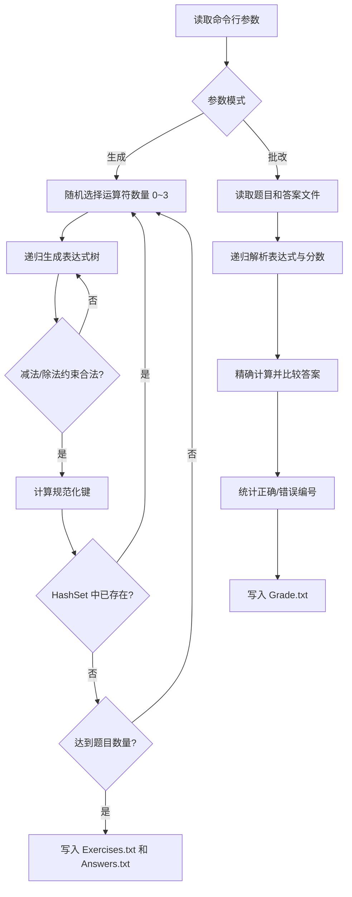

# 小学四则运算题目生成程序

> [!NOTE]
>
> 一个使用 Java 开发的命令行程序，用于自动生成小学四则运算题目、计算标准答案，并对答题结果进行批改。

## 项目信息

| 项目            | 内容                                                         |
| --------------- | ------------------------------------------------------------ |
| 课程作业        | 软件工程——自动生成小学四则运算题目的命令行程序               |
| 开发语言        | Java                                                         |
| 成员 1          | 李文争    3124004171                                         |
| 成员 2          | 陈卓浩    3124004162                                         |
| GitHub 项目地址 | https://github.com/LS-XH/3124004171/tree/main/%E5%B0%8F%E5%AD%A6%E5%9B%9B%E5%88%99%E8%BF%90%E7%AE%97%E9%A2%98%E7%9B%AE |

## 项目状态

- [x] 完成需求梳理、项目设计和 PSP 预估
- [x] 实现 Java 程序并补充设计实现过程
- [x] 使用 JFR 进行效能分析与优化
- [x] 完成测试并记录结果
- [x] 补充 PSP 实际耗时和项目总结

## 主要功能

- 生成包含自然数、分数、四则运算符和括号的算术题目。
- 通过参数控制题目数量和数值范围。
- 保证减法过程不产生负数，除法结果为真分数。
- 每道题最多包含 3 个运算符，同一次生成的题目不会重复。
- 自动生成与题目一一对应的标准答案。
- 支持读取题目文件和答案文件，统计正确、错误题目及其编号。
- 支持一次生成 10,000 道题目。

## 使用方法

### 使用 BAT 启动 JAR

> [!CAUTION]
>
> 使用 BAT 需要计算机已安装 JDK 17 或更高版本并配置好 `PATH`；如果希望不安装 Java，请使用下方的 EXE 版本。

项目根目录提供了 `Myapp.bat` 启动脚本。它会自动定位同目录下的 `Myapp.jar`，因此不需要再输入 `java -jar Myapp.jar`。先执行一次构建，然后在项目目录中直接输入 BAT 文件名和参数即可：

**生成题目**：

```powershell
.\Myapp.bat -n 10 -r 10
```

- `-n`：生成题目的数量。
- `-r`：题目中数值的上限，不包含该上限；该参数必须提供。

也可以使用省略 `-n`、批改答案和查看帮助等参数：

```powershell
.\Myapp.bat -r 10
```

**批改答案**：

```powershell
.\Myapp.bat -e .\Exercises.txt -a .\Answers.txt
.\Myapp.bat --help
```

脚本支持把参数原样传递给程序，也可以从其他目录调用，例如：


### 使用JAR

> [!CAUTION]
>
> 运行环境要求：JDK 17 或更高版本。先在项目目录执行：`.\build.ps1`
>
> 构建成功后，项目目录中会生成可执行文件 `Myapp.jar`。

**生成题目**：

```text
java -jar Myapp.jar -n 10 -r 10
```

- `-n`：生成题目的数量。
- `-r`：题目中数值的上限，不包含该上限；该参数必须提供。

题目和答案将分别写入程序当前运行目录下的 `Exercises.txt` 和 `Answers.txt`。

题目示例：

```text
1. 1/6 + 1/8 =
2. 3 × (2 + 1) =
```

答案示例：

```text
1. 7/24
2. 9
```

分数使用最简形式输出。假分数以带分数表示，例如二又八分之三输出为 `2’3/8`。

**批改答案**：

```text
java -jar Myapp.jar -e Exercises.txt -a Answers.txt
```

批改结果将写入当前运行目录下的 `Grade.txt`：

```text
Correct: 5 (1, 3, 5, 7, 9)
Wrong: 5 (2, 4, 6, 8, 10)
```

### 使用EXE

> [!CAUTION]
>
> 请先解压`dist\Myapp-windows-x64.zip`文件，以使用exe
>
> 然后直接使用 `dist\Myapp` 目录中的可执行文件。EXE 已包含裁剪后的 JRE，不需要另行安装 Java。

生成 10 道数值小于 10 的题目：

```powershell
.\dist\Myapp\Myapp.exe -n 10 -r 10
```

省略 `-n` 时默认生成 10 道题：

```powershell
.\dist\Myapp\Myapp.exe -r 10
```

程序会在当前命令行目录生成：

- `Exercises.txt`：题目文件；
- `Answers.txt`：标准答案文件。

批改指定的题目和答案：

```powershell
.\dist\Myapp\Myapp.exe -e .\Exercises.txt -a .\Answers.txt
```

批改结果会写入当前命令行目录的 `Grade.txt`。如果文件不在当前目录，可以使用绝对路径或相对路径：

```powershell
.\dist\Myapp\Myapp.exe -e "D:\Math\Exercises.txt" -a "D:\Math\StudentAnswers.txt"
```

查看帮助：

```powershell
.\dist\Myapp\Myapp.exe --help
```

### 打包 Windows EXE

开发者在安装 JDK 17 的计算机上执行：

```powershell
.\package.ps1
```

打包结果位于：

```text
dist/
├── Myapp/
│   ├── Myapp.exe
│   ├── app/
│   └── runtime/
└── Myapp-windows-x64.zip
```

## 设计实现过程

### 1. 总体组织

项目共有 17 个 Java 源文件，按照“命令行入口—业务服务—表达式模型—解析与文件读写”分层组织。各层只依赖下一层的职责接口，避免把参数解析、随机生成、数学计算和文件格式处理混写在一个类中。

```text
Main
├── cli.CommandLineOptions                 参数解析与模式校验
├── service.ExerciseService                生成流程编排
│   └── generator.ExerciseGenerator       随机表达式生成与判重
├── service.GradingService                 批改流程编排
│   └── parser.ExpressionParser            表达式/答案解析
├── model.Expression                       表达式抽象
│   ├── NumberExpression                   数值叶子节点
│   └── BinaryExpression                   运算二叉树节点
├── model.Fraction、Operator                精确分数运算与运算符
└── io.ExerciseFileRepository              UTF-8 文件读写
```

### 2. 类和函数职责

| 类或接口 | 类型 | 关键函数 | 作用 |
| --- | --- | --- | --- |
| `Main` | 程序入口 | `main`、`run` | 创建依赖对象，按照命令行模式调用生成或批改服务，并统一处理异常和退出码 |
| `CommandLineOptions` | 参数对象 | `parse` | 解析 `-n`、`-r`、`-e`、`-a`、`--help`，校验参数组合和正整数 |
| `ExerciseService` | 服务类 | `generateAndWrite` | 调用生成器获得题目，再交给仓储一次性写入题目和答案 |
| `ExerciseGenerator` | 生成器 | `generate`、`generateExpression`、`generateNumber` | 随机构造 0～3 个运算符的表达式，检查减法、除法、范围、唯一性等约束 |
| `Expression` | 接口 | `evaluate`、`format`、`canonicalKey` | 统一表达式节点的求值、显示、运算符计数和判重键操作 |
| `NumberExpression` | 模型类 | `evaluate`、`format` | 表示表达式树中的数值叶子节点 |
| `BinaryExpression` | 模型类 | `evaluate`、`format`、`canonicalKey` | 表示左右子树和一个运算符，负责优先级括号和交换等价判重 |
| `Fraction` | 值对象 | `add`、`subtract`、`multiply`、`divide`、`toDisplayString` | 用 `BigInteger` 保存最简分数，避免浮点误差，并按题目格式输出自然数、真分数和带分数 |
| `ExpressionParser` | 解析器 | `parse`、`parseFraction` | 使用递归下降法解析括号、四则运算和分数文本 |
| `GradingService` | 服务类 | `grade` | 读取题目与作答，解析并精确比较答案，收集正确和错误编号 |
| `ExerciseFileRepository` | 仓储类 | `writeGeneratedFiles`、`readLines`、`writeGrade` | 负责 `Exercises.txt`、`Answers.txt`、`Grade.txt` 的 UTF-8 读写 |
| `GradeResult`、`Exercise` | record | `format`、访问器 | 封装批改统计结果和带编号题目，减少流程类中的可变状态 |
| `Operator` | enum | `apply`、`precedence` | 集中定义四种运算符的符号、优先级、交换性和计算行为 |

异常类 `UserInputException`、`ExpressionParseException` 和 `ExerciseGenerationException` 分别表示参数错误、表达式格式错误和生成失败，使 `Main` 可以给出清晰的错误提示。

### 3. 模块之间的关系

程序启动后，`Main.run` 先调用 `CommandLineOptions.parse` 得到不可变参数对象。生成模式下，`ExerciseService` 调用 `ExerciseGenerator.generate`；生成器返回的每个 `Exercise` 内部持有一棵 `Expression` 二叉树，表达式节点通过 `Fraction` 计算答案。服务最后调用 `ExerciseFileRepository.writeGeneratedFiles` 输出两个文件。

批改模式下，`GradingService` 通过仓储读取文本，使用 `ExpressionParser` 解析题目表达式和答案分数，再调用 `Fraction.equals` 比较；统计结果由 `GradeResult.format` 格式化后写入 `Grade.txt`。因此，文件格式变化只影响仓储和解析器，不会影响分数算法和题目生成器。

### 4. 关键算法实现

题目生成采用递归构造表达式树。叶子节点在 `[0, range)` 中生成自然数或合法分数；内部节点随机选择运算符。每个候选节点立即计算左右子树的值：减法要求左值不小于右值，除法要求除数非零且商为真分数，不满足约束的候选直接重试。表达式的 `canonicalKey` 对加法和乘法的左右子树键排序，对减法和除法保留左右顺序，再用 `HashSet` 判断同一次运行中的交换等价重复题目。

`ExpressionParser` 按“加减层—乘除层—基本项层”递归下降，天然实现运算优先级；`BinaryExpression.format` 根据子树优先级补充必要括号，保证输出文本重新解析后含义不变。

### 5. 关键流程图

生成和批改是最容易出现边界错误的流程，因此绘制流程图比只描述类关系更直观。以下 Mermaid 图可在 GitHub 或支持 Mermaid 的 Markdown 查看器中渲染。



题目生成过程如下：

1. 在 0～3 范围内随机确定运算符数量，递归构造表达式二叉树。
2. 每生成一个运算节点就计算左右子树结果。减法只接受左值不小于右值的情况；除法只接受除数非零且商为真分数的情况。
3. 为表达式生成规范化键。加法和乘法节点将左右子树键按固定顺序排列，减法和除法保持原顺序，从而识别题目要求中的交换等价表达式。
4. 使用 `HashSet` 保存规范化键，重复题目重新生成；达到指定数量后写出题目和标准答案。

批改时，程序从题目行中提取表达式并重新解析、精确求值，再与答案文件中相同编号的答案比较。答案缺失或内容无法解析时，该题计入错误。关键约束、判重和容错位置均在源代码中保留了解释性注释。

更详细的需求、算法和流程图见[项目设计与开发计划](docs/项目设计与开发计划.md)。

## 代码说明

下面列出项目中最能体现核心设计的代码片段。完整实现位于 `src/main/java`，此处只展示关键逻辑，便于阅读和维护。

### 1. 命令行入口与异常处理

`Main.run` 不直接实现生成算法，而是负责组装对象和分派模式。这样可以让生成、批改逻辑脱离控制台，测试时也能直接传入参数和临时工作目录。

```java
CommandLineOptions options = CommandLineOptions.parse(args);
if (options.mode() == CommandLineOptions.Mode.GENERATE) {
    ExerciseService service = new ExerciseService(
            new ExerciseGenerator(), repository);
    service.generateAndWrite(
            options.exerciseCount(), options.range(), workingDirectory);
} else {
    GradingService service = new GradingService(repository);
    GradeResult result = service.grade(
            options.exerciseFile(), options.answerFile(), workingDirectory);
    out.print(result.format());
}
```

参数格式错误、文件读写错误和算术错误分别捕获并转换为不同的退出码，同时输出帮助信息，避免把 Java 异常堆栈直接暴露给使用者。

### 2. 生成表达式并保证题目约束

`ExerciseGenerator.generateExpression` 递归构造表达式树。每次创建二叉节点后立即计算左右值，并在返回前验证减法和除法规则；注释说明了交换子树和复用计算结果的优化原因。

```java
Fraction leftValue = left.evaluate();
Fraction rightValue = right.evaluate();

// 减法必须保证结果非负；交换子树比丢弃整棵候选树更高效。
if (operator == Operator.SUBTRACT
        && leftValue.compareTo(rightValue) < 0) {
    Expression expression = left;
    left = right;
    right = expression;
    Fraction value = leftValue;
    leftValue = rightValue;
    rightValue = value;
}

if (operator == Operator.DIVIDE) {
    // 除数不能为 0，且商必须是真分数。
    if (leftValue.isZero() || rightValue.isZero()
            || leftValue.equals(rightValue)) {
        return null;
    }
    if (leftValue.compareTo(rightValue) > 0) {
        // 让较小的数作为被除数，保证结果小于 1。
        Expression expression = left;
        left = right;
        right = expression;
    }
}

Fraction result = operator.apply(leftValue, rightValue);
return BinaryExpression.withPrecomputedValue(
        left, operator, right, result);
```

生成完成后，程序使用 `HashSet<String>` 保存规范化键。键已存在时丢弃候选题，确保同一次运行中不存在交换等价的重复题目。

### 3. 加法和乘法的规范化判重

`BinaryExpression.canonicalKey` 只对当前节点的加法或乘法交换左右键，不展平整棵树。因此既能识别 `23 + 45` 与 `45 + 23`，又能保留不同结合结构的区别。

```java
String leftKey = left.canonicalKey();
String rightKey = right.canonicalKey();

// + 和 × 满足交换律，固定较小键在前，消除左右交换造成的重复。
if (operator.isCommutative()
        && leftKey.compareTo(rightKey) > 0) {
    String temporary = leftKey;
    leftKey = rightKey;
    rightKey = temporary;
}
return operator.name() + "(" + leftKey + "," + rightKey + ")";
```

减法和除法不进入交换分支，括号结构也保留在表达式树中，符合题目对等价题目的定义。

### 4. 使用分数对象进行精确计算

`Fraction` 内部使用 `BigInteger` 保存分子和分母，并在构造时约分。下面的除法实现通过交叉相乘构造新分数，不进行 `double` 转换，因此不会产生浮点误差。

```java
public Fraction divide(Fraction other) {
    if (other.isZero()) {
        throw new ArithmeticException("除数不能为 0");
    }
    return new Fraction(
            numerator.multiply(other.denominator),
            denominator.multiply(other.numerator));
}
```

`toDisplayString` 再把最简分数转换为自然数、真分数或带分数格式，保证输出文件与题目要求一致。

### 5. 文件输出与职责隔离

`ExerciseFileRepository` 统一负责 UTF-8 文件操作，服务层只传入题目集合和输出目录。题目、答案先用 `StringBuilder` 组装，再分别写入文件，减少大量小写入操作。

```java
StringBuilder exercisesText = new StringBuilder();
StringBuilder answersText = new StringBuilder();
for (Exercise exercise : exercises) {
    exercisesText.append(exercise.number())
            .append(". ").append(exercise.expression().format())
            .append(" =\n");
    answersText.append(exercise.number())
            .append(". ").append(exercise.expression().evaluate().toDisplayString())
            .append('\n');
}
Files.writeString(exercisesPath, exercisesText.toString(), UTF_8);
Files.writeString(answersPath, answersText.toString(), UTF_8);
```

## 效能分析与改进

### 分析方法

使用 JDK 17.0.12 自带的 Java Flight Recorder（JFR），以“生成并写入 10,000 道题、数值范围为 10”作为工作负载。性能基准固定随机种子为 `20260920`，在同一 JVM 中预热 10 次后测量 30 次，以中位耗时作为主要指标，避免单次启动、即时编译和偶发调度造成误差。JFR 使用 `profile` 配置，同时记录 CPU 采样、对象分配和垃圾回收。

本轮效能分析与改进共用时 **30 分钟**：基线录制和热点定位 8 分钟，代码优化 12 分钟，复测与正确性回归 6 分钟，整理图表和文档 4 分钟。

可使用下列命令复现当前版本的录制：

```powershell
.\profile\run-jfr.ps1 -RecordingName recording
```

### JFR 定位结果

优化前 JFR 共取得 100 个执行采样。最上层项目方法热点如下：

| 热点方法 | 采样数 | 原因 |
| --- | ---: | --- |
| `Fraction.<init>` | 31 | 每个分数都执行最大公约数和约分，自然数也未走快速路径 |
| `Fraction.toDisplayString` | 26 | 自然数和真分数同样执行 `divideAndRemainder` |
| `Fraction.canonicalKey` | 14 | 相同自然数反复转换为判重字符串 |
| `ExerciseFileRepository.writeGeneratedFiles` | 10 | 题目和答案逐行调用写入方法 |

JDK 17 的 `profile.jfc` 将 `jdk.ExecutionSample` 周期设置为 10 ms。以下时间按“某方法作为项目代码顶部栈帧的采样数 × 10 ms”计算，是函数的**独占 CPU 时间估算**，适合比较热点占比，但不等同于对每次函数调用进行插桩得到的精确墙钟时间。

| 函数 | 优化前采样/估算 | 优化后采样/估算 | 变化 |
| --- | ---: | ---: | ---: |
| `Fraction.<init>` | 31 次 / 310 ms | 8 次 / 80 ms | 减少 74.2% |
| `Fraction.toDisplayString` | 26 次 / 260 ms | 18 次 / 180 ms | 减少 30.8% |
| `Fraction.canonicalKey` | 14 次 / 140 ms | 12 次 / 120 ms | 减少 14.3% |
| `writeGeneratedFiles` | 10 次 / 100 ms | 15 次 / 150 ms | 归属到批量组装的采样增加 |


优化前消耗最大的项目函数是 `Fraction.<init>`，估算独占 CPU 时间为 310 ms。优化后降至 80 ms。`writeGeneratedFiles` 的顶部采样增加，是因为优化后题目文本批量组装也归属到该方法，并不表示磁盘写入单独变慢；端到端中位耗时仍明显下降。

此外，除法候选为了检查真分数先计算一次，构造表达式时又计算一次；不合法的减法和大于等于 1 的除法会丢弃整棵已创建的表达式树。基线录制期间发生了 9 次年轻代 GC，说明临时对象和失败重试具有优化空间。

### 优化内容

1. 减法左右值顺序不满足要求时直接交换子树；除法将较小的非零值放在左侧，减少已经生成的表达式被整体丢弃。
2. 表达式生成器把约束检查时得到的计算结果传入 `BinaryExpression`，避免合法除法被重复计算。
3. `Fraction` 为分母为 1 和分子为 0 的情况增加快速构造路径，并缓存 0～100 的常用自然数对象。
4. 缓存不可变分数的规范键和显示文本；真分数直接复用规范文本，不再执行 `divideAndRemainder`。
5. 题目和答案先写入 `StringBuilder`，再各执行一次文件写入，减少逐行调用开销。
6. 批改结果的题号拼接改用 `Collectors.joining`，避免大量答案时反复创建中间字符串。

### 优化结果

| 指标 | 优化前 | 优化后 | 变化 |
| --- | ---: | ---: | ---: |
| 中位耗时 | 33.946 ms | 21.471 ms | **减少 12.475 ms（36.7%）** |
| 平均耗时 | 34.587 ms | 23.763 ms | 减少 10.824 ms（31.3%） |
| 最小耗时 | 30.184 ms | 18.999 ms | 减少 11.185 ms（37.1%） |
| 最大耗时 | 49.261 ms | 40.257 ms | 减少 9.004 ms（18.3%） |
| 年轻代 GC 次数 | 9 | 7 | 减少 2 次（22.2%） |

最终 JFR 中 `Fraction.<init>` 位于最上层项目方法的采样数由 31 降至 8，表明自然数缓存、快速构造和减少失败重试有效降低了分数对象处理成本。优化后重新生成 10,000 道题并用标准答案批改，结果仍为 10,000 道全部正确，且没有完全相同的题目文本，每道题的运算符数量仍不超过 3。


## 测试运行

### 测试方法与环境

测试环境为 Windows、JDK 17.0.12。项目提供不依赖第三方库的 Java 回归测试入口，以便在只安装 JDK 的机器上直接复现。执行命令如下：

```powershell
.\test.ps1
```

脚本会重新编译主程序和测试程序，在 `build/test-work` 中创建隔离的临时文件，测试结束后自动清理。本次运行结果为：

```text
SUMMARY passed=14 failed=0 total=14 elapsed_ms=285.519
```

### 测试用例及结果

| 编号 | 测试内容 | 输入或操作 | 预期结果 | 实际结果 |
| --- | --- | --- | --- | --- |
| T01 | 分数精确运算与约分 | `1/6 + 1/8`、`6/12` | 分别得到 `7/24`、`1/2` | 通过，结果完全一致 |
| T02 | 真分数、带分数和整数格式 | 格式化 `3/5`、`19/8`、`12/3` | `3/5`、`2’3/8`、`4` | 通过，三种格式正确 |
| T03 | 运算优先级和括号 | `1/2 + 3 × (2 − 1/3)`；`1/2 ÷ 3/4` | `5’1/2`；`2/3` | 通过，精确值为 `11/2`、`2/3` |
| T04 | 加法、乘法交换判重 | `23 + 45` 与 `45 + 23`；`6 × 8` 与 `8 × 6` | 两组规范键分别相等 | 通过，均识别为重复 |
| T05 | 题目指定的嵌套判重 | `3 + (2 + 1)`、`1 + 2 + 3`、`3 + 2 + 1` | 前两者重复，第三个不重复；格式化后树结构不变 | 通过，与题目示例一致 |
| T06 | 随机题目的全部生成约束 | 固定种子生成 1,000 道，`r=10` | 数值和分母小于 10；减法非负；除法商为真分数；每题 1～3 个运算符；无交换等价重复 | 通过，递归检查所有节点均合法 |
| T07 | 默认数量及文件格式 | 执行 `-r 10` | 退出码 0；两个文件各 10 行；编号和等号格式正确 | 通过，题目和答案各 10 行 |
| T08 | 缺少必填参数 | 执行 `-n 10`，不提供 `-r` | 退出码 2，并显示缺少 `-r` 和帮助信息 | 通过，错误处理符合预期 |
| T09 | 生成与批改端到端流程 | 固定种子生成 100 道，再用生成的标准答案批改 | `Correct: 100`、`Wrong: 0`，生成 `Grade.txt` | 通过，100 道全部正确 |
| T10 | 错答、非法答案及缺失答案 | 第 1 题正确，第 2 题错误，第 3 题为 `abc`，第 4 题缺失 | `Correct: 1 (1)`；`Wrong: 3 (2, 3, 4)` | 通过，分类和编号完全一致 |
| T11 | 最小范围边界 | 固定种子执行 `n=10, r=1` | 成功生成 10 道题，所有叶子数值均小于 1 | 通过，生成 10 道合法题目 |
| T12 | 一万道题支持能力 | 固定种子生成 10,000 道，`r=10` | 数量为 10,000；规范键无重复；运算符不超过 3 | 通过，10,000 个规范键全部唯一 |
| T13 | 非法表达式输入 | `1 + (2 × 3`；`1/0` | 分别因括号缺失和分母为 0 拒绝解析 | 通过，均抛出预期解析异常 |
| T14 | 帮助参数 | 执行 `--help` | 退出码 0，显示生成和批改用法 | 通过，帮助信息完整 |

### 正确性说明

测试不仅比较若干固定答案，还从以下层面验证程序：

1. **基础数学正确性**：对约分、分数四则运算、带分数和表达式优先级使用人工可验证的确定答案。
2. **结构规则正确性**：直接验证作业给出的三组判重示例，并检查表达式格式化、重新解析后规范键不变。
3. **生成性质正确性**：对固定种子生成的 1,000 道题递归遍历每一个表达式节点，而不是只检查最终答案，因此能发现中间减法为负数或中间除法不是真分数的问题。
4. **规模与唯一性**：对 10,000 道题的规范键使用集合检查，确认不是只消除文本完全相同的题目，同时验证运算符数量上限。
5. **完整流程正确性**：从生成题目、写入文件、读取解析到批改输出进行端到端测试，并覆盖全对、错答、非法答案和缺失答案。
6. **边界与错误处理**：覆盖 `r=1`、缺少 `-r`、非法分母、括号缺失和帮助参数，验证正常路径之外的行为。

测试源代码位于 `src/test/java`，每次修改核心算法后均可通过 `test.ps1` 重复运行。

## PSP 2.1

时间单位为分钟。实际耗时按开发、调试、文档整理和打包过程记录填写，并统一取整到 5 分钟。

| PSP2.1                                  | Personal Software Process Stages         | 预计耗时（分钟） | 实际耗时（分钟） |
| --------------------------------------- | ---------------------------------------- | ---------------: | ---------------: |
| Planning                                | 计划                                     |               30 |               35 |
| · Estimate                              | · 估计这个任务需要多少时间               |               30 |               35 |
| Development                             | 开发                                     |              700 |              680 |
| · Analysis                              | · 需求分析（包括学习新技术）             |               60 |               50 |
| · Design Spec                           | · 生成设计文档                           |               70 |               55 |
| · Design Review                         | · 设计复审（和同事审核设计文档）         |               30 |               25 |
| · Coding Standard                       | · 代码规范（为目前的开发制定合适的规范） |               20 |               15 |
| · Design                                | · 具体设计                               |               60 |               50 |
| · Coding                                | · 具体编码                               |              260 |              250 |
| · Code Review                           | · 代码复审                               |               60 |               45 |
| · Test                                  | · 测试（自我测试、修改代码、提交修改）   |              140 |              190 |
| Reporting                               | 报告                                     |              210 |              160 |
| · Test Report                           | · 测试报告                               |               60 |               50 |
| · Size Measurement                      | · 计算工作量                             |               30 |               20 |
| · Postmortem & Process Improvement Plan | · 事后总结，并提出过程改进计划           |              120 |               90 |
| **合计**                                |                                          |          **940** |          **875** |

开发过程中的需求分析、架构设计、算法方案、测试计划和效能分析计划记录在[项目设计与开发计划](docs/项目设计与开发计划.md)中。

## 项目小结

### 1. 成果、得失与经验

本项目最终完成了题目生成、标准答案计算、答案批改、文件输出、10,000 道题规模支持和 Windows EXE 打包等功能。实现过程中最重要的设计决策是使用表达式二叉树和 `Fraction` 值对象：前者让括号、优先级和交换等价判重有明确的数据结构，后者避免了浮点数计算带来的误差。通过 JFR 定位热点后，又对自然数分数对象、失败重试、结果缓存和批量文件写入进行了优化，性能和可维护性都有所提升。

项目做得较好的地方是分层比较清晰，生成、解析、批改和文件读写可以分别测试；测试也覆盖了正常输入、边界值、非法表达式、重复题目和一万道题的规模场景。相对不足的是，早期主要关注核心算法，命令行提示、打包方式和 README 结构是在后期逐步补充的，导致文档和使用入口经历了几次调整；部分随机生成约束在范围较小时候选空间有限，也需要设置重试上限并给出错误提示。

本次项目的主要经验是：第一，应先把自然语言需求转换成可验证的不变量，例如“减法节点左值不小于右值”“除法结果是真分数”“规范键唯一”；第二，涉及分数时应从一开始就使用精确表示，而不是先用浮点数再修正；第三，生成器、解析器和批改器都应尽早准备固定种子和小规模测试，避免最后才发现边界问题；第四，性能优化必须先测量再修改，JFR 采样和优化前后对比比凭感觉改代码更可靠。

### 2. 结对感受

结对开发让需求理解、代码实现和结果检查形成了连续的反馈。一个人负责实现或修改时，另一人可以从作业条款、用户使用方式和异常情况重新审视结果，减少“代码能运行但没有完全满足要求”的情况。通过共同讨论表达式判重和除法约束，我们也更清楚地认识到，算法正确性不仅要看最终答案，还要检查表达式树中间节点的状态。

结对过程中的不足是前期任务拆分和同步节奏还可以更明确：如果能在开始时就约定接口、提交粒度和验收清单，后期整合 README、JFR 结果和 EXE 使用说明会更高效。今后可以采用“先写接口和测试，再并行实现，最后做一次联合演示”的方式，减少重复修改。

