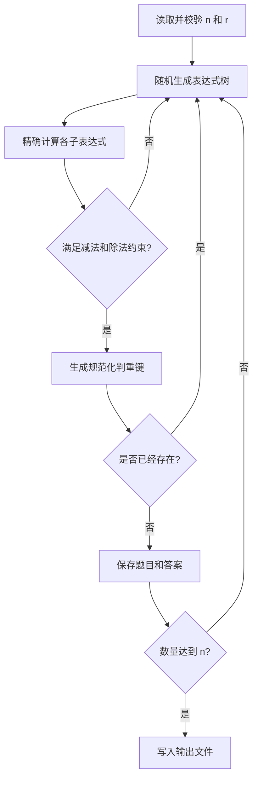

# 项目设计与开发计划

本文档用于记录小学四则运算题目生成程序的需求分析、设计方案、开发规范、测试与效能分析计划。面向使用者的项目介绍、使用方式和 PSP 时间记录请参阅项目根目录的 `README.md`。

## 1. 需求分析

### 1.1 功能需求

1. 使用 `-n` 指定生成题目数量；未提供时计划默认生成 10 道题。
2. 使用必填参数 `-r` 指定自然数、分数整数部分和分母的取值上界，数值不能达到该上界。
3. 表达式的任意减法子表达式都不得产生负数。
4. 除法的除数不得为零，且每个除法子表达式的结果必须大于 0、小于 1。
5. 每道题包含的运算符不超过 3 个。
6. 同一次运行生成的题目不能重复。交换加法或乘法节点的左右子表达式后能够相同的题目视为重复，但不擅自使用结合律改变原表达式树结构。
7. 题目和答案分别写入当前运行目录的 `Exercises.txt` 和 `Answers.txt`，序号逐行对应。
8. 程序能够在合理时间内生成 10,000 道题目。
9. 使用 `-e` 和 `-a` 指定题目文件和答案文件，批改结果写入 `Grade.txt`。

### 1.2 表达式及输出约定

- 运算数包括自然数和非负分数，所有分数在内部约分为最简形式。
- 小于 1 的非零分数输出为 `分子/分母`，如 `3/5`。
- 大于 1 且不能整除的分数输出为带分数，如 `2’3/8`。
- 整数结果直接输出为自然数。
- 运算符和等号两侧保留一个空格，乘除符号使用 `×` 和 `÷`。
- 根据表达式树的计算顺序添加必要括号。
- 题目行格式为 `序号. 表达式 =`，答案行格式为 `序号. 答案`。

### 1.3 参数规则

| 场景 | 合法参数 | 处理方式 |
| --- | --- | --- |
| 生成题目 | `-r <自然数>`，可同时使用 `-n <正整数>` | 生成题目和答案文件 |
| 批改答案 | `-e <题目文件> -a <答案文件>` | 生成 `Grade.txt` |
| 参数缺失、重复或数值非法 | 不合法 | 输出错误原因和帮助信息，以非零状态结束 |
| 两种模式混用 | 不合法 | 输出帮助信息，不生成文件 |

`-r` 接受大于等于 1 的自然数。当数值范围过小、约束过严而无法得到足够多的不重复题目时，程序需要明确报错，不能无限重试。

### 1.4 质量目标

- 使用精确分数计算，避免浮点误差。
- 生成、计算、格式化、判重、读写和批改模块相互分离，便于测试和维护。
- 正确处理非法参数、零除、文件不存在、行格式错误和答案数量不一致。
- 通过 JFR 分析并改进生成 10,000 道题时的性能。

## 2. 总体设计

### 2.1 分层结构

```text
命令行入口
├── 参数解析与运行模式选择
├── 题目生成服务
│   ├── 随机表达式树生成
│   ├── 合法性约束
│   ├── 等价判重
│   └── 题目与答案输出
├── 批改服务
│   ├── 题目/答案读取
│   ├── 表达式解析与求值
│   └── 正误统计输出
└── 领域模型与公共工具
    ├── 表达式节点
    ├── 精确分数
    └── 格式化与文件读写
```

### 2.2 计划中的核心类

| 类/接口 | 主要职责 |
| --- | --- |
| `Main` | 程序入口，解析参数并选择生成或批改模式 |
| `CommandLineOptions` | 保存并校验命令行参数 |
| `ExerciseGenerator` | 按数量和范围生成合法、不重复的表达式 |
| `Expression` | 表达式节点的统一接口，提供求值、输出和规范化能力 |
| `NumberExpression` | 自然数或分数叶子节点 |
| `BinaryExpression` | 保存左右子表达式和运算符的二元节点 |
| `Operator` | 定义加、减、乘、除及其优先级 |
| `Fraction` | 完成精确四则运算、比较、约分和格式化 |
| `ExpressionFormatter` | 按优先级和结合方向添加必要括号并输出文本 |
| `ExpressionCanonicalizer` | 生成判重键，处理 `+`、`×` 左右交换等价 |
| `ExerciseService` | 协调生成、计算及题目和答案文件写入 |
| `ExpressionParser` | 将题目文本解析为表达式树 |
| `GradingService` | 比较计算结果与用户答案并统计题号 |
| `ExerciseFileRepository` | 集中处理 UTF-8 文件读写 |

编码时可以根据实际职责合并简单类，但不能把生成、求值、判重和批改逻辑全部放在入口类中。

### 2.3 核心数据结构

表达式使用二叉树表示。叶子节点保存一个 `Fraction`，非叶子节点保存运算符以及左右子树。每个节点都能够递归求值、按优先级输出字符串，并生成用于判重的规范化键。

`Fraction` 采用“分子/分母”形式保存，分母始终为正数，构造后立即使用最大公约数约分。计算过程不使用 `double`。编码阶段将根据溢出风险在 `long` 和 `BigInteger` 中选择合适的实现。

## 3. 关键算法设计

### 3.1 表达式生成

1. 随机确定 1～3 个运算符。
2. 递归构造表达式树，并将剩余运算符数量分配给左右子树。
3. 在 `-r` 的范围约束下生成叶子节点。
4. 构造运算节点后计算左右子树结果：减法只接受左值不小于右值的组合；除法只接受除数非零且结果大于 0、小于 1 的组合。
5. 生成规范化判重键，若已经存在则重新生成。
6. 达到指定数量后写入题目和答案文件。

生成过程将设置单题重试上限，防止在小范围、大数量条件下无限循环。是否采用候选池、缓存或结构枚举等优化，将根据 JFR 结果决定。



### 3.2 等价判重

对每个表达式节点递归产生结构化键：

- 数值节点使用约分后的分子和分母生成唯一键。
- `-`、`÷` 节点严格保留左右子树顺序。
- `+`、`×` 节点比较左右子树的规范化键，按固定顺序排列后组成父节点键。

规范化键保留原表达式树结构，只允许交换任意加法或乘法节点的左右子树。所有键存入 `HashSet`，平均查重复杂度为 `O(1)`。

### 3.3 括号输出

输出时比较子节点和父节点的优先级。子节点优先级较低时添加括号；优先级相同时，再根据子节点位置和运算符决定是否添加括号，尤其处理减法与除法的右子树，保证文本重新解析后与原树语义相同。

### 3.4 答案批改

1. 按编号读取题目文件和答案文件。
2. 去除题目末尾等号，以递归下降方式解析自然数、普通分数、带分数、括号和四种运算符。
3. 精确计算题目结果并解析用户答案。
4. 比较约分后的 `Fraction`。
5. 分别记录正确和错误题号，写入 `Grade.txt`。

缺失或格式非法的答案记为错误；输入文件无法读取或题目格式不符合约定时，程序给出明确错误信息。

## 4. 代码规范

- 包名全小写；类名使用 `UpperCamelCase`；方法和变量使用 `lowerCamelCase`；常量使用 `UPPER_SNAKE_CASE`。
- 类保持单一职责，公开方法提供必要的 Javadoc。
- 对判重、括号、分数约分和生成约束等关键逻辑添加解释设计原因的注释。
- 参数错误由入口层集中处理并打印帮助信息。
- 文件统一使用 UTF-8 编码，并自动关闭文件资源。
- 随机数生成器通过构造参数注入，测试时使用固定种子以保证结果可复现。

## 5. 测试计划

实现完成后至少覆盖以下内容，并在测试阶段补充不少于 10 个可复现用例及实际结果：

1. 合法和非法命令行参数；
2. 题目数量、编号和文件格式；
3. 数值范围边界，包括 `-r 1`；
4. 分数约分和带分数格式；
5. 四种运算和嵌套括号求值；
6. 减法非负约束；
7. 除法结果为真分数的约束；
8. 运算符数量不超过 3；
9. 可交换运算的等价判重；
10. 10,000 道题的生成能力和耗时；
11. 全对、全错、部分正确、答案缺失及非法答案的批改；
12. 不存在文件、空文件和异常行的错误处理。

计划采用 JUnit 编写自动化测试，并执行完整命令行集成测试，核对三个输出文件。

## 6. 效能分析计划

完成可运行版本后，使用 Java Flight Recorder 记录生成 10,000 道题时的 CPU、方法采样、对象分配和垃圾回收情况，重点检查：

- 随机表达式生成与失败重试次数；
- 分数构造与最大公约数计算；
- 规范化判重键生成；
- 表达式字符串格式化；
- 文件批量写入。

优化前后将使用相同参数、相同随机种子、JDK 版本和硬件环境，经过预热后进行多次测量并报告中位用时。后续在本文档中补充 JFR 截图、热点函数和优化前后数据，当前阶段不填写未经测量的性能结果。

## 7. PSP 记录

PSP 2.1 表格需要作为作业展示内容保留在项目根目录的 `README.md` 中。当前已填写预计耗时，项目收尾阶段将在同一表格中补充实际耗时。

## 8. 开发与提交计划

1. **项目规划**：完成用户 README、本设计文档和 PSP 预估。
2. **核心实现**：创建 Java 项目，实现分数、表达式、生成、格式化、判重、文件输出和批改功能，并更新设计实现说明。
3. **效能分析与优化**：使用 JFR 获取基线，定位热点，完成针对性优化并记录前后数据。
4. **测试与报告**：完成至少 10 个测试用例，记录命令、预期结果、实际结果和正确性说明。
5. **项目收尾**：补充 PSP 实际耗时、项目小结、结对感受、彼此闪光点和改进建议。

当前第一阶段的建议提交信息：

```text
docs: 完成项目设计与PSP预估
```

## 9. 后续记录清单

- [ ] 设计实现过程及关键代码说明
- [ ] JFR 性能分析截图、热点函数及优化前后数据
- [ ] 至少 10 个测试用例和实际运行结果
- [ ] PSP 实际耗时
- [ ] 项目小结、结对感受、闪光点和建议
